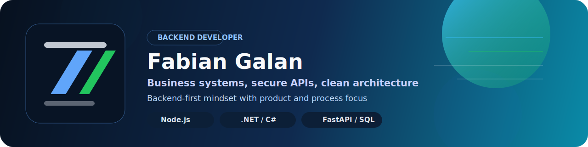

  

  
  
  
  

  
  
  

---

  

Backend developer focused on building useful software for real operational and business workflows.

I work on secure APIs, authentication and role-based access, document workflows, domain logic, integrations, and administrative systems using `Node.js`, `TypeScript`, `C#`, `.NET`, `Python`, `FastAPI`, `PostgreSQL`, and `MySQL`.

My interest is not just writing code. I care about turning business processes into maintainable systems with clear architecture, practical decisions, and room to scale.

---

  

### Languages

### Backend and Platforms

### Data and Tools

---

  

<table>
  <tr>
    <td valign="top" width="50%">
      <h3>Apex</h3>
      
Technical participation in a business-oriented academic and administrative platform, contributing to backend modules, JWT authentication, role-based authorization, operational flows, payments, and document automation.

      

        
        
        
      

    </td>
    <td valign="top" width="50%">
      <h3>Agora</h3>
      
Technical work on a document compliance system oriented to SG-SST processes, including API development, role-based access, document approval flows, validation, and operational control over uploaded files.

      

        
        
        
      

    </td>
  </tr>
  <tr>
    <td valign="top" width="50%">
      <h3>KoalaWS / Koala Widget</h3>
      
Technical collaboration on an embeddable feedback and incident-reporting product, contributing to feature scope, report capture flows, backend-oriented integration thinking, and MVP delivery in a team environment.

      

        
        
        
      

    </td>
    <td valign="top" width="50%">
      <h3>OpenJobEngine</h3>
      
Personal backend project focused on job aggregation, data normalization, vacancy history, background processing, CV parsing, and explainable matching for opportunity discovery workflows.

      

        
        
        
      

    </td>
  </tr>
</table>

> `Apex`, `Agora`, and `KoalaWS` are presented as projects where I had meaningful technical participation and delivery, while `OpenJobEngine` is my own backend initiative.

---

  

- REST APIs with authentication, authorization, and business rules.
- Administrative and operational systems with modular backend structure.
- Document workflows, PDF-related processes, and data handling pipelines.
- SQL-backed applications where domain entities and process flows matter.
- Product-oriented implementation with attention to architecture and maintainability.

---

  

  
  

---

  

