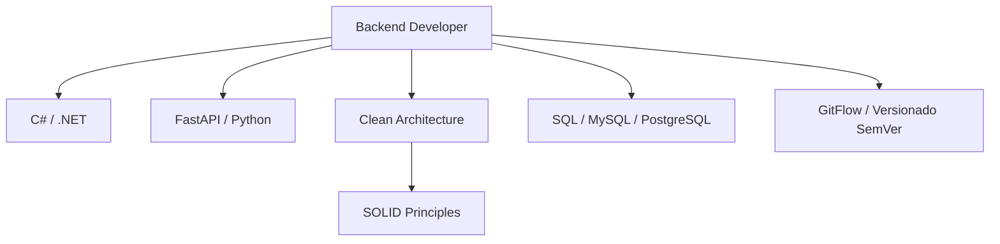
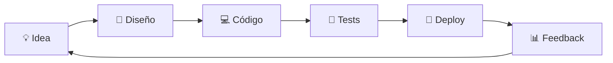

<!-- Profile README for Kodigo -->

<h1 align="center">✨ Kodigo</h1>
<p align="center"><strong>Backend Developer | Product Owner | Clean Architecture Enthusiast</strong></p>

```
╔════════════════════════════════════════════════════════════════╗
║    code. craft. iterate. ship.                                  ║
║    clean architecture believer | pragmatic product mindset      ║
╚════════════════════════════════════════════════════════════════╝
```

---

## 👨‍💻 Sobre mí
- Arquitecto de soluciones backend especializado en **C# / .NET**, **FastAPI** y ecosistemas basados en SQL.
- Entusiasta de la **arquitectura limpia**, flujos CI/CD y metodologías ágiles con enfoque en valor al usuario.
- Creando productos como **AutoTallerManager**, **CampusLove**, **DocsFlow** y **TechZone** con énfasis en calidad, escalabilidad y métricas.
- "El aprendizaje continuo es el motor que impulsa cada línea de código." 🚀

---

## 🧰 Tech Stack
<div align="center">

| Lenguajes | Frameworks & Plataformas | Bases de Datos | Herramientas |
|-----------|--------------------------|----------------|--------------|
|      |     |   |     |

</div>

---

## 🧩 Diagrama de Conocimientos


---

## 🚀 Proyectos Destacados

> Selección de productos donde combino visión de negocio con ingeniería robusta.

<table>
  <tr>
    <td>
      <strong>💡 AutoTallerManager</strong><br/>
      Sistema de gestión de talleres mecánicos con .NET 9, MySQL y Clean Architecture.<br/>
      <a href="https://github.com/Kodigo/AutoTallerManager">Repositorio</a>
    </td>
    <td>
      <strong>❤️ CampusLove</strong><br/>
      Plataforma social universitaria orientada a matching y eventos en tiempo real.<br/>
      <a href="https://github.com/Kodigo/CampusLove">Repositorio</a>
    </td>
  </tr>
  <tr>
    <td>
      <strong>📄 DocsFlow</strong><br/>
      Automatización documental con flujos de aprobación y analítica integrada.<br/>
      <a href="https://github.com/Kodigo/DocsFlow">Repositorio</a>
    </td>
    <td>
      <strong>🛒 TechZone</strong><br/>
      E-commerce modular construido con microservicios y arquitectura hexagonal.<br/>
      <a href="https://github.com/Kodigo/TechZone">Repositorio</a>
    </td>
  </tr>
</table>

---

## 📈 Estadísticas y Actividad
<div align="center">
  
  
  
</div>

---

## 🤝 Contacto & Redes
<p align="center">
  <a href="mailto:kodigo.dev@gmail.com"></a>
  <a href="https://www.linkedin.com/in/kodigo"></a>
  <a href="https://kodigo.dev"></a>
</p>

---

## 🛠️ Herramientas que uso a diario
- Documentación rápida en **Notion** y **Obsidian** para seguimiento de decisiones técnicas.
- Pipelines en **GitHub Actions** + despliegues con **Docker** y **Azure App Service**.
- Monitoreo con **Seq**, **Grafana** y tableros orientados a métricas de producto.

---

## 🔄 Workflow de Desarrollo


---

<p align="center">Construyendo experiencias digitales con foco en rendimiento, mantenibilidad y negocio. ✨</p>

